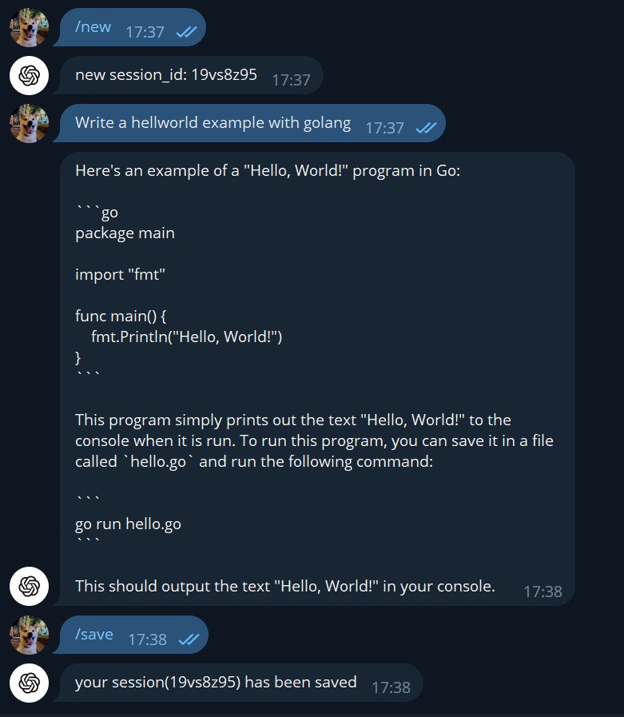

# ChatGPT Telegram-Bot/CLI Tool

This project uses the OpenAI API to enable conversational capabilities both in the command console and through a Telegram bot. The ChatGPT API is used to process natural language, understand the intent of the user and generate appropriate responses. (This introduction is almost written by ChatGPT)

## Usage

To use this tool, please follow these instructions:

1. Clone the repository to your local machine.

```
git clone https://github.com/princewang1994/chatgpt-telegram-bot-cli.git
cd chatgpt-telegram-bot-cli/
```

2. Install the requirements using pip.

```
pip install -r requirements.txt
```

3. Write your own config

```shell
cp configs/example.yaml configs/my.yaml
```

here is an example:

```yaml
openai:
  api_key: "YOUR_OPENAI_API_KEY"

save:
  root: "./session"

tgbot:
  token: "TELEGRAM TOKEN"  # if run with telegram bot
```

4. To run the script in the command console, run the following code:

for cli mode:

```shell
python3 launch.py --config=configs/my.yaml
```

for telegram-bot mode:

```shell
python launch.py --config=configs/my.yaml --mode=tgbot
```


## CLI mode

Command List: 
- `help`: show this document
- `his`: show history of current session
- `ls`: list all saved sessions
- `new`: create a new session
- `resume`: resume specific session with session id
- `save`: save current session
- `^C`: cancel inputing
- `^D`: exit chatting

An example:

```
[System] There is no saved session, create a new one.
You have started a new chat session
Command List:
        [help]: show this document
        [his]: show history of current session
        [ls]: list all saved sessions
        [new]: create a new session
        [resume]: resume specific session with session id
        [save]: save current session
<User>: 你好
<ChatGPT>: 你好！有什么我可以帮你的吗？
<User>: Write a hellworld example with golang
<ChatGPT>: Sure, here's a "Hello World" example in Go:

"```"
package main

import "fmt"

func main() {
    fmt.Println("Hello, world!")
}
"```"

When you run this program, it will print the message "Hello, world!" to the console.

To run this program, save it in a file called `hello.go`. Then, navigate to the directory where the file is saved using the command prompt or terminal, and run the command:

"```"
go run hello.go
"```"

You should see the output "Hello, world!" printed to the console.
<User>: thx
<ChatGPT>: You're welcome! If you have any other questions or tasks, feel free to ask.
```


## Telegram Mode

Command List: 
- `/his`: show history of current session
- `/ls`: list all saved sessions
- `/new`: create a new session
- `/save`: save current session

Screenshot: 

